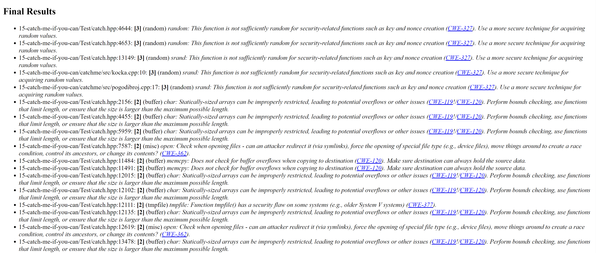
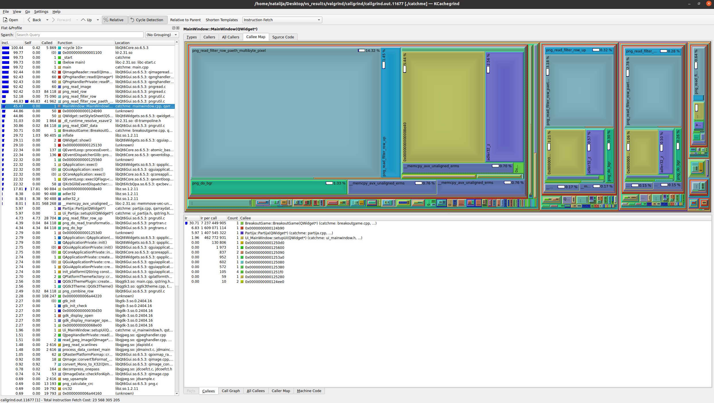
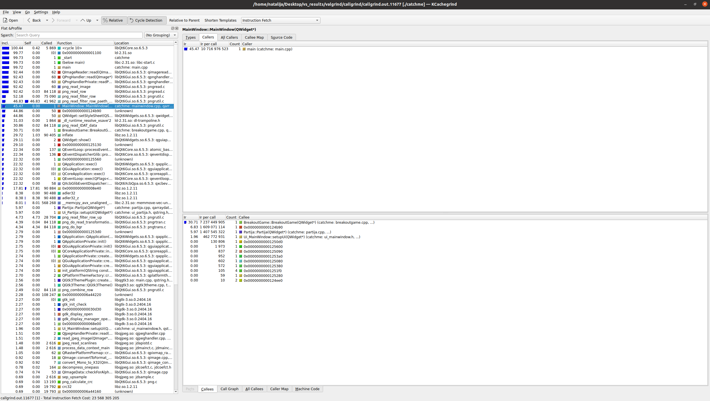

# Izveštaj analize projekta

## Clang alati

**Clang** je kompilator koji se koristi za jezike C, C++, Objective C i Objective C++. Posmatramo ga kao frontend koji na ulazu dobije kod koji je napisan u nekom od nabrojanih jezika i prevodi ga u međureprezentaciju. Backend vrši optimizacije vezane za konkretnu arhitekturu i da prevodi kod na mašinski jezik.

Implementiran je u C++.

### Clang-Tidy

**Clang-Tidy** predstavlja jedan od *Clang* zasnovanih alata koji obavlja statičku analizu koda (vrši analiziranje izvornog koda bez njegovog izvršavanja sa ciljem pronalaženja grešaka, poboljšanja kvaliteta koda i ispravljanja neoptimalno napisanih delova koda). **Clang-Tidy** je *C++* linter alati koji analizira kod i pronalazi programske i stilske greške unutar koda.

Ovaj alat je integrisan u okviru *QtCreator*-a i njegova upotreba je opisana u nastavku.

* Izabrati karticu *Analyze*, a zatim odabrati alat *Clang-Tidy* iz padajućeg menija.

   

* Izabrati fajlove nad kojima želimo da primenimo analizu.

   

* Klikom na dugme *Analyze* pokreće se analiza nad izabranim fajlovima.
* Dobijen je sledeći rezultat.
  
  
  
  **Komentar:** U gore navedenom primeru, analiza je pokrenuta nad svim fajlovima i sa podrazumevanom konfiguracijom. Analiza sa ovom konfiguracijom nije vratila nikakva upozorenja.

* Dodavanje *custom* konfiguracije:
   - Izabrati karticu *Edit* i u njoj izabrati *Preferences* iz padajućeg menija.
   - U listi sa leve strane izabrati stavku *Analyzer*.
   - U okviru ovog prozora može se dodati nova konfiguracija.
   - Dodavanje nove konfiguracije *ClangCustomCheck*, koja pored podrazumevane _clang-*_ opcije ima i opcije _performance-*_ i _readability-*_.
     
  

* Ponovnim pokretanjem analize nad svim fajlovima dobija se sledeći rezultat.

   

  **Komentar:** Ovog puta analiza je vratila više različitih upozorenja. Upozorenja koja se najčešće javljaju u projektu i koja su prikazana na prethodnoj slici, govore da bi magične brojeve trebalo zameniti uvođenjem konstanti, kao i da bi nazivi pormenjljivih koje se javljaju u petlji trebalo da budu duži od dva karaktera.


### Clazy

**Clazy** je alat koji pomaže *Clang*-u da razume Qt semantiku. Njegov zadatak je da prikazuje upozorenja kompajlera vezana za Qt, kao što su nepravilno korišćenje API-ja, potencijalno curenje memorije, nepravilne konverzije tipova podataka...

Ovaj alat je takođe integrisan u okviru *QtCreator*-a i njegova upotreba je opisana u nastavku.

* Podrazumevana konfiguracija obuhvata dva nivoa provere (0 i 1). Prilikom pokretanja ovog alata, izabrana je *custom* konfiguracija (*ClangCustomCheck*) u kojoj je odabran samo nivo 0 (Bez lažnih pozitivnih upozorenja).

   

* Pokretanje je slično kao kod *Clang-Tidy* alata,  izabere se kartica *Analyze*, a zatim u noj alat *Clazy* iz padajućeg menija.

   
  
* Klikom na dugme *Analyze* pokrece se analiza nad izabranim fajlovima.
* Dobijen je sledeći rezultat.

  

  **Komentar:** U gore navedenom primeru, analiza je pokrenuta nad svim fajlovima i vratila je dve vrste upozorenja. Jedno se javlja u više fajlova i osnosi se na imena slotova koja nisu konzistentna sa ostalim imenima (koristi se ime sa podvlakama umesto kamilje notacije). Drugo upozorenje odnosi se na listu (*QList\<int\>*) koja je inicijalizovana, ali nije nigde upotrebljena.


## Cppcheck

**Cppcheck** je alat koji se koristi za statičku analizu C i C++ koda. Osnovna uloga je otkrivanje potencijalnih problema pre pokretanja programa. Detektuje curenja memorije, neinicijalizovane promenljive, potencijalne probleme sa pokazivačima...

Za instalaciju *Cppcheck* alata potrebno je u terminalu pokrenuti sledeću komandu:
```
sudo apt-get install cppcheck
```

Dodatne opcije koje su korišćene prilikom analize:
- *--inconclusive* : alat prijavljuje i neodlučne greške (greške koje nije mogao da kategorizuje kao greške ili upozorenja i bez ove opcije ih ne bi uključio u izveštaj)
- *--enable=all* : alat uključuje sve dostupne provere koje može da izvrši
- *--suppress=missingInclude* : alat ignoriše greske koje se dobijaju iz *header*-a (kako bi se izbegao problem sa proveravanjem eksternih biblioteka koje se uključuju u *header* fajlovima)
- *--output-file="cppcheck-output.txt"* : rezultat koji se dobija analizom biće upisan u fajl *cppckeck-output.txt*

Komanda na kraju izgleda ovako:
```
cppcheck --inconclusive --enable=all --suppress=missingInclude --output-file="cppcheck-output.txt" 15-catch-me-if-you-can
```

Pokreće se pomoću [skripte](cppcheck/run_cppcheck.sh):
```
./run_cppcheck.sh
```

Kompletan izveštaj dobijen primenom *cppcheck* alata nalazi se u fajlu [*cppcheck-output.txt*](cppcheck/cppcheck-output.txt).

Neki od primera iz izveštaja:

* > 15-catch-me-if-you-can/catchme/src/igrac.cpp:3:8: warning:inconclusive: Member variable 'Igrac::_id' is not initialized in the constructor. [uninitMemberVar]
Igrac::Igrac()

   **Komentar:** Alat upozorava da nije inicijalizovana vrednost promenljive `Igrac::_id` u konstruktoru.


* > 15-catch-me-if-you-can/Test/catch.hpp:9408:0: style: Consider using std::any_of algorithm instead of a raw loop. [useStlAlgorithm]
                if( normaliseOpt( name ) == normalisedToken )

   **Komentar:** Alat predlaže da se iskoristi ugrađena funkcija `std::any_of` umesto petlje.

* > 15-catch-me-if-you-can/catchme/src/lopta.cpp:15:5: performance: Variable '_boja' is assigned in constructor body. Consider performing initialization in initialization list. [useInitializationList]
    _boja = (Qt::blue);

     **Komentar:** Alat predlaže da prilikom kreiranja klase koristi lista inicijalizacije, umesto inicijalizovanja promenljive `_boja` unutar tela konstrukta.

* > 15-catch-me-if-you-can/catchme/src/partija.cpp:40:0: style: The function 'getBrojIgraca' is never used. [unusedFunction]

     **Komentar:** Alat upozorava da funkcija `getBrojIgraca` nije nigde pozvana.
  

## Flawfinder

**Flawfinder** je alat koji služi za otkrivanje bezbedonosnih propusta u programima napisanim u *C* i *C++* programskom jeziku. Koristi predefinisani skup pravila i sa njima pretražuje izvorni kod kako bi pronašao potencijalno nebezbedna mesta unutar programa. Kao rezultat primene ovog alata dobija se izveštaj sa propustima, pri čemu se svakom propustu dodeljuje određeni nivo značajnosti. 

Za instalaciju *Flawfinder* alata potrebno je u terminalu pokrenuti sledeću komandu:
```
sudo apt-get install flawfinder
```

Dodatna opcija koja je korišćena prilikom analize:
- *--html* : izveštaj je napisan u *html* formatu

Komanda kojom je pokrenuta analiza izgleda ovako:
```
flawfinder --html 15-catch-me-if-you-can > flawfinder_result.html
```

Pokreće se pomoću [skripte](flawfinder/run_flawfinder.sh), koja nakon izvršavanja komade otvara *flawfinder_result.html* u **Firefox**-u:
```
./run_flawfinder.sh
```

Kompletan rezultat primene *Flawfinder* alata nalazi se u fajlu [*flawfinder_result.html*](flawfinder/flawfinder_result.html).
U okviru tog *html* fajla, za svaku od prijavljenih grešaka postoji link ka dokumentaciji gde se mogu naći detaljnije informacije o samoj grešci.

   

Neke od prijavljenih grešaka:

   * ***CWE-327*** :
        - Upozorava da program koristi neispravan ili rizičan kriptografski algoritam ili protokol. Ovo može dovesti do otkrivanja osetljivih informacija, lažiranja identitea, modifikovanja podataka i drugih neželjenih događaja.
        - Analiza je ovom propustu dodelila nivo **3**. Upozorenje se odnosi na funkcije `random` i `srand` u nekoliko različitih fajlova.
   * ***CWE-119 / CWE-120***  :
        - Upozorenja govore da program radi sa memorijskim baferom bez proveravanja negove veličine. Upozorenje predlaže proveru veličine bafera kako bi se izbeglo čitanje i pisanje van opsega statički alociranog bafera.
        - Analiza je ovom propustu dodelila nivo **2**.
   * ***CWE-362*** :
        - Upozorava da program sadrži sekvencu koja zahteva privremeni ekskluzivi pristup deljenim podacima, ali da to nije obezbeđeno.
        - Analiza je ovom propustu dodelila nivo **2**. Ovo upozorenje se pojavljuje sedam puta u izveštaju i svuda se odnosi na otvaranje fajlova pomoću funkcije `open`.

          

## Vlagrind alati

Valgrind je profajler otvorenog koda koji nadgleda funkcionisanje programa i prijavljuje nepravilnosti u radu tog programa ukoliko one postoje. 

Valgrind obuhvata sledeće alate: 
* *Memcheck* (detektor memorijskih grešaka)
* *Massif* (praćenje rada dinamičke memorije)
* *Callgrind* (profajler funkcija)
* *Cachegrind* (profajler keš memorije)
* *Hellgrind* i *DRD* (detektori grešaka u radu sa nitima)

Za instalaciju *Valgrind* alata potrebno je u terminalu pokrenuti sledeću komandu:
```
sudo apt-get install valgrind
```

U okviru projekta analiza je rađena pomocu alata *Memcheck* i *Callgrind*.


### Memcheck

**Memcheck** je alat koji se prilikom korišćenja Valgrind-a podrazumevano poziva. Koristi se za detektovanje memorijskih grešaka i sprovođenja analize nad mašinskim kodom. 
Upotrebom *Memcheck*-a mogu se otkriti različite vrste problema, kao što su curenja memorije, pristup ili upisivanje vrednosti van opsega, korišćenje neinicijalizovanih vrednosti, pristup već oslobođenoj memoriji.

Dodatne opcije koje su korišćene prilikom analize:
- *--show-lead-kinds=all* : prikazuje sve vrse curenja memorije u programu
- *--leak-check=full* : daje informacije o svim definitivno izgubljenim ili eventualno izgubljenim blokovima, uključujući i informacije o njihovoj alokaciji
- *--tack-origins=yes* : omogućava lakše pronalaženje dela programa u kom se nalazi memoriski propust (može usporiti rad alata)
- *--log-file="report-memcheck.txt"* : rezultati analize će biti upisani u *report-memcheck.txt* fajl

Pre pokretanja komande potrebno je prevesti program u **Debug** režimu.

Komanda kojom je pokrenuta analiza na kraju izgleda ovako:
```
valgrind --show-leak-kinds=all --leak-check=full --track-origins=yes --log-file="report-memcheck.txt" ./catchme 
```

Pokreće se pomoću [skripte](valgrind/memcheck/run_memcheck.sh):
```
./run_memcheck.sh
```

Kompletan izveštaj dobijen primenom *Memcheck* alata nalazi se u fajlu [*report-memcheck.txt*](valgrind/memcheck/report-memcheck.txt).

Sažetak analize (`12120` je PID):
```
==12120== LEAK SUMMARY:
==12120==    definitely lost: 2,560 bytes in 4 blocks
==12120==    indirectly lost: 14,811 bytes in 622 blocks
==12120==      possibly lost: 12,411 bytes in 158 blocks
==12120==    still reachable: 336,728,275 bytes in 26,955 blocks
==12120==                       of which reachable via heuristic:
==12120==                         length64           : 19,504 bytes in 262 blocks
==12120==                         newarray           : 13,560 bytes in 137 blocks
==12120==         suppressed: 0 bytes in 0 blocks
```

Primer steka poziva:
```
==12120== 314,112,000 bytes in 24 blocks are still reachable in loss record 12,385 of 12,385
==12120==    at 0x483B7F3: malloc (in /usr/lib/x86_64-linux-gnu/valgrind/vgpreload_memcheck-amd64-linux.so)
==12120==    by 0x50DC135: QImageData::create(QSize const&, QImage::Format) (qimage.cpp:145)
==12120==    by 0x50DC45A: QImage::QImage(QSize const&, QImage::Format) (qimage.cpp:799)
==12120==    by 0x50DC495: QImage::QImage(int, int, QImage::Format) (qimage.cpp:783)
==12120==    by 0x50DC792: QImage::copy(QRect const&) const (qimage.cpp:1204)
==12120==    by 0x50DCCD2: QImage::detach() (qimage.cpp:1111)
==12120==    by 0x50DFD8B: reinterpretAsFormat (qimage.cpp:2360)
==12120==    by 0x50DFD8B: QImage::reinterpretAsFormat(QImage::Format) (qimage.cpp:2350)
==12120==    by 0x5114679: QRasterPlatformPixmap::createPixmapForImage(QImage, QFlags<Qt::ImageConversionFlag>) (qpixmap_raster.cpp:301)
==12120==    by 0x51149D9: QRasterPlatformPixmap::fromImage(QImage const&, QFlags<Qt::ImageConversionFlag>) (qpixmap_raster.cpp:109)
==12120==    by 0x511D169: QPlatformPixmap::fromFile(QString const&, char const*, QFlags<Qt::ImageConversionFlag>) (qplatformpixmap.cpp:101)
==12120==    by 0x5112D2F: QPixmap::load(QString const&, char const*, QFlags<Qt::ImageConversionFlag>) (qpixmap.cpp:729)
==12120==    by 0x4A6BB94: QStyleSheetStyle::loadPixmap(QString const&, QObject const*) (qstylesheetstyle.cpp:6492)
```

**Komentar:** Iz sažetka možemo videti da ima dosta primera curenja memorije (definitivno izgubljene, inidirektno izgubljene i moguće izgubljene memorije). Ispitivanjem steka poziva primećuje se da su `Qt` ugrađene funkcije skoro uvek odgovorne za alociranje memorije na hipu. \
Unutar samog [*Catch me if you can*](https://gitlab.com/matf-bg-ac-rs/course-rs/projects-2022-2023/15-catch-me-if-you-can) projekta najčešće se koriste prazni (ugrađeni) destruktori, koji nisu dovoljni kako bi se zaista oslobodila memorija na hipu, što izaziva curenje memorije. \
Dobra praksa bi bila i uvođenje *unique_ptr* i *shared_ptr* pokazivača, na mestima gde je to pogodno, jer oni sami brinu o svom oslobađanju.


### Callgrind

Callgrind je alat za profajliranje koji čuva istoriju poziva funkcija u programu kao graf poziva.\
Neke od informacija koje se mogu dobiti za zadati program su:
* broj izvršenih instrukcija
* odnosi izvršenih instrukcija sa odgovarajućim linijama koda
* caller/callee odnos između funkcija (sa frekvencijama)
* informacije o keširanju (promašaji, pogodci, ...)

Dodatna opcija koja je korišćena prilikom analize:
- *--log-file="report-callgrind"* : rezultati analize će biti upisani u *report-callgrind* fajl

Pre pokretanja komande potrebno je prevesti program u **Profile** režimu.

Komanda kojom je pokrenuta analiza izgleda ovako:
```
valgrind --tool=callgrind --log-file="report-callgrind" ./catchme
```

Pokreće se pomoću [skripte](valgrind/callgrind/run_callgrind.sh):
```
./run_callgrind.sh
```

Kao rezultat analize, pored *report-callgrind* fajla dobija se i [*callgrind.out.11677*](valgrind/callgrind/callgrind.out.11677) fajl (`11677` je PID). \
*callgrind.out.11677* moze se otvoriti pomoću **KCachegrind** pomoćnog alata za vizuelizaciju.

Prikaz *Calle Map* i *Calles* za funkciju *MainWindow(QWidget\*)*:



Na sledećoj slici sa leve strane nalaze se informacije o broju poziva svake funkcije i broju instrukcija koje je zahtevalo njeno izvršavanje, samostalno i uključujući izvršavanja drugih funkcija koje je pozivala. Na desnoj strani izabrana je opcija *Callers* koja prikazuje funkcije koje su pozivale funkciju *MainWindow(QWidget\*)*.



**Komentar:** Posmatranjem izveštaja, moze se zaključiti da nema velikog broja poziva funkcija u delu koda koji su implementirali programeri projekta.
