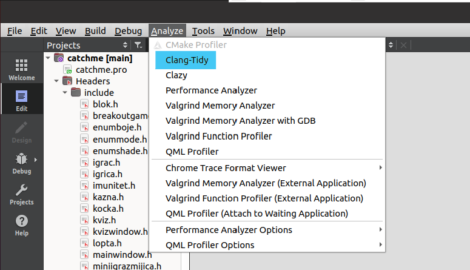
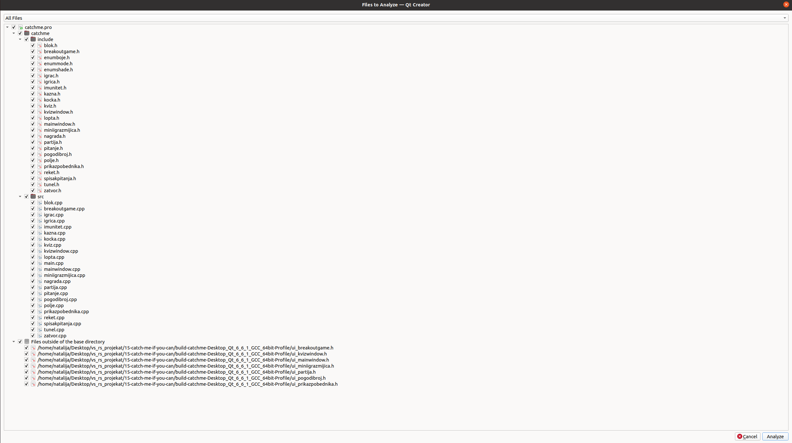
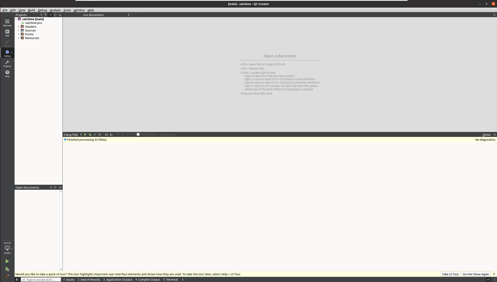
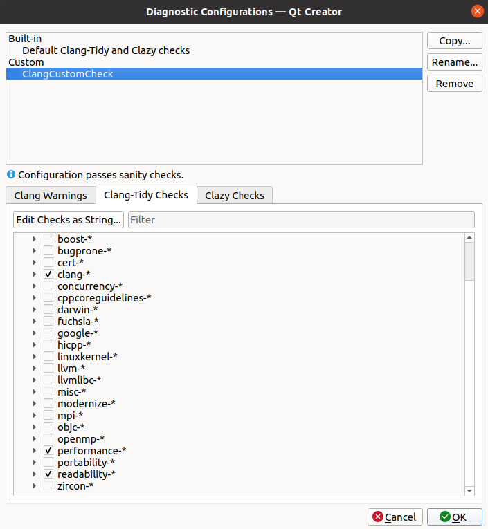
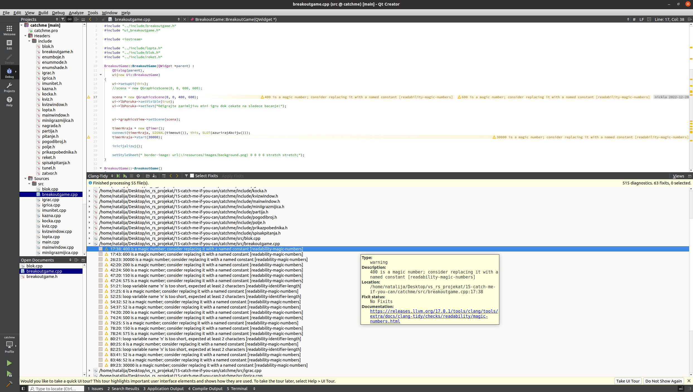
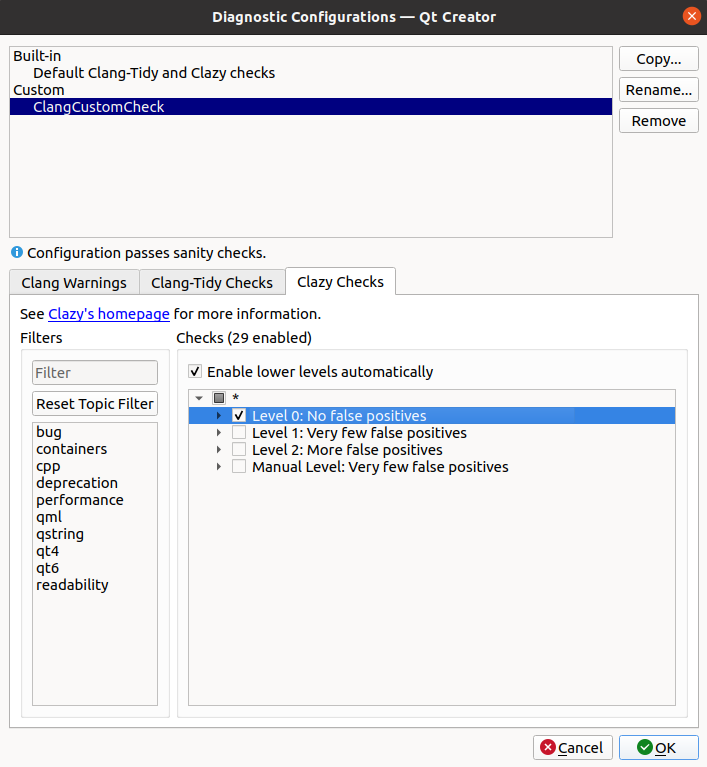
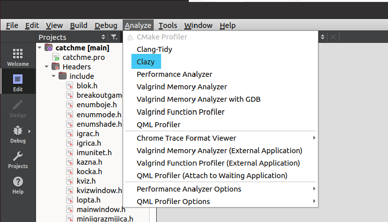
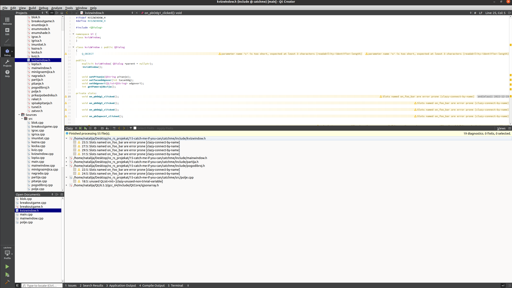

# Izveštaj analize projekta

## Clang alati

**Clang** je kompilator koji se koristi za jezike C, C++, Objective C i Objective C++. Posmatramo ga kao frontend koji na ulazu dobije kod koji je napisan u nekom od nabrojanih jezika i prevodi ga u međureprezentaciju. Backend vrši optimizacije vezane za konkretnu arhitekturu i da prevodi kod na mašinski jezik.

Implementiran je u C++.

### Clang-Tidy

**Clang-Tidy** predstavlja jedan od *Clang* zasnovanih alata koji obavlja statičku analizu koda (vrši analiziranje izvornog koda bez njegovog izvršavanja sa ciljem pronalaženja grešaka, poboljšanja kvaliteta koda i ispravljanja neoptimalno napisanih delova koda). **Clang-Tidy** je *C++* linter alati koji analizira kod i pronalazi programske i stilske greške unutar koda.

Ovaj alat je integrisan u okviru *QtCreator*-a i njegova upotreba je opisana u nastavku.

* Izabrati karticu *Analyze*, a zatim odabrati alat *Clang-Tidy* iz padajućeg menija.

   

* Izabrati fajlove nad kojima želimo da primenimo analizu.

   

* Klikom na dugme *Analyze* pokreće se analiza nad izabranim fajlovima.
* Dobijen je sledeći rezultat.
  
  
  
  **Komentar:** U gore navedenom primeru, analiza je pokrenuta nad svim fajlovima i sa podrazumevanom konfiguracijom. Analiza sa ovom konfiguracijom nije vratila nikakva upozorenja.

* Dodavanje *custom* konfiguracije:
   - Izabrati karticu *Edit* i u njoj izabrati *Preferences* iz padajućeg menija.
   - U listi sa leve strane izabrati stavku *Analyzer*.
   - U okviru ovog prozora može se dodati nova konfiguracija.
   - Dodavanje nove konfiguracije *ClangCustomCheck*, koja pored podrazumevane _clang-*_ opcije ima i opcije _performance-*_ i _readability-*_.
     
  

* Ponovnim pokretanjem analize nad svim fajlovima dobija se sledeći rezultat.

   

  **Komentar:** Ovog puta analiza je vratila više različitih upozorenja. Upozorenja koja se najčešće javljaju u projektu i koja su prikazana na prethodnoj slici, govore da bi magične brojeve trebalo zameniti uvođenjem konstanti, kao i da bi nazivi pormenjljivih koje se javljaju u petlji trebalo da budu duži od dva karaktera.


### Clazy

**Clazy** je alat koji pomaže *Clang*-u da razume Qt semantiku. Njegov zadatak je da prikazuje upozorenja kompajlera vezana za Qt, kao što su nepravilno korišćenje API-ja, potencijalno curenje memorije, nepravilne konverzije tipova podataka...

Ovaj alat je takođe integrisan u okviru *QtCreator*-a i njegova upotreba je opisana u nastavku.

* Podrazumevana konfiguracija obuhvata dva nivoa provere (0 i 1). Prilikom pokretanja ovog alata, izabrana je *custom* konfiguracija (*ClangCustomCheck*) u kojoj je odabran samo nivo 0 (Bez lažnih pozitivnih upozorenja).

   

* Pokretanje je slično kao kod *Clang-Tidy* alata,  izabere se kartica *Analyze*, a zatim u noj alat *Clazy* iz padajućeg menija.

   
  
* Klikom na dugme *Analyze* pokrece se analiza nad izabranim fajlovima.
* Dobijen je sledeći rezultat.

  

  **Komentar:** U gore navedenom primeru, analiza je pokrenuta nad svim fajlovima i vratila je dve vrste upozorenja. Jedno se javlja u više fajlova i osnosi se na imena slotova koja nisu konzistentna sa ostalim imenima (koristi se ime sa podvlakama umesto kamilje notacije). Drugo upozorenje odnosi se na listu (*QList\<int\>*) koja je inicijalizovana, ali nije nigde upotrebljena.


## Cppcheck

**Cppcheck** je alat koji se koristi za statičku analizu C i C++ koda. Osnovna uloga je otkrivanje potencijalnih problema pre pokretanja programa. Detektuje curenja memorije, neinicijalizovane promenljive, potencijalne probleme sa pokazivačima...

Za instalaciju *Cppcheck* alata potrebno je u terminalu pokrenuti sledeću komandu:
```
sudo apt-get install cppcheck
```

Dodatne opcije koje su koriscene prilikom analize:
- *--inconclusive* : alat prijavljuje i neodlučne greške (greške koje nije mogao da kategorizuje kao greške ili upozorenja i bez ove opcije ih ne bi uključio u izveštaj)
- *--enable=all* : alat uključuje sve dostupne provere koje može da izvrši
- *--suppress=missingInclude* : alat ignoriše greske koje se dobijaju iz *header*-a (kako bi se izbegao problem sa proveravanjem eksternih biblioteka koje se uključuju u *header* fajlovima)
- *--output-file="cppcheck-output.txt"* : rezultat koji se dobija analizom biće upisan u fajl *cppckeck-output.txt*

Komanda na kraju izgleda ovako:
```
cppcheck --inconclusive --enable=all --suppress=missingInclude --output-file="cppcheck-output.txt" 15-catch-me-if-you-can
```

Kompletan izveštaj dobijen primenom *cppcheck* alata nalazi se u fajlu [*cppcheck-output.txt*](cppcheck/cppcheck-output.txt).

Neki od primera iz izveštaja:

* > 15-catch-me-if-you-can/catchme/src/igrac.cpp:3:8: warning:inconclusive: Member variable 'Igrac::_id' is not initialized in the constructor. [uninitMemberVar]
Igrac::Igrac()

   **Komentar:** Alat upozorava da nije inicijalizovana vrednost promenljive `Igrac::_id` u konstruktoru.


* > 15-catch-me-if-you-can/Test/catch.hpp:9408:0: style: Consider using std::any_of algorithm instead of a raw loop. [useStlAlgorithm]
                if( normaliseOpt( name ) == normalisedToken )

   **Komentar:** Alat predlaže da se iskoristi ugrađena funkcija `std::any_of` umesto petlje.

* > 15-catch-me-if-you-can/catchme/src/lopta.cpp:15:5: performance: Variable '_boja' is assigned in constructor body. Consider performing initialization in initialization list. [useInitializationList]
    _boja = (Qt::blue);

     **Komentar:** Alat predlaže da prilikom kreiranja klase koristi lista inicijalizacije, umesto inicijalizovanja promenljive `_boja` unutar tela konstrukta.

* > 15-catch-me-if-you-can/catchme/src/partija.cpp:40:0: style: The function 'getBrojIgraca' is never used. [unusedFunction]

     **Komentar:** Alat upozorava da funkcija `getBrojIgraca` nije nigde pozvana.
